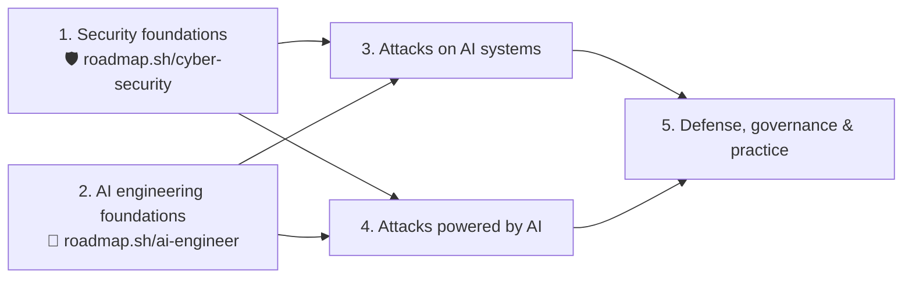

# AI × Security Study Roadmap

A personal study plan that combines two public roadmaps:

| Roadmap | Link |
|---|---|
| 🤖 **AI Engineer** | https://roadmap.sh/ai-engineer |
| 🛡️ **Cyber Security** | https://roadmap.sh/cyber-security |

Related roadmaps worth opening alongside: [AI Red Teaming](https://roadmap.sh/ai-red-teaming) · [AI Agents](https://roadmap.sh/ai-agents) · [Prompt Engineering](https://roadmap.sh/prompt-engineering)

## Why combine these two?

Attacks are changing in two ways at once:

1. **Attacks *on* AI systems.** LLM apps, RAG pipelines, and agents with tools add new attack surface: prompt injection, poisoned documents, over-privileged agents, malicious MCP servers, leaked system prompts. These are hard to defend without knowing how the systems are built, which is **AI engineering** knowledge.
2. **Attacks *using* AI.** Phishing written by LLMs, deepfake voice and video fraud, faster reconnaissance, and automated vulnerability discovery. The classic defenses still apply (MFA, least privilege, verification procedures, patching, monitoring), which is **security** knowledge.

Studying either roadmap alone leaves a gap. This plan puts them side by side so each security topic is paired with the AI concept it now touches, and the reverse.

> This is a learning log, not an authoritative curriculum. See the [main README](../README.md) for the disclaimer.

## About roadmap.sh content

roadmap.sh's content is copyrighted, and its license allows sharing **links** but not republishing its text or diagrams. So this folder **doesn't copy the roadmaps**. Everything here is my own grouping and wording, with links back to roadmap.sh for the full, interactive roadmaps. Open them side by side while studying.

## The plan

| Phase | Focus | Mainly draws on | Status |
|---|---|---|---|
| 1 | [Security foundations](01-security-foundations.md) | 🛡️ Cyber Security | 🟡 in progress (CS50 done, Network+ next) |
| 2 | [AI engineering foundations](02-ai-engineering-foundations.md) | 🤖 AI Engineer | ⬜ not started |
| 3 | [Attacks on AI systems](03-attacks-on-ai-systems.md) | 🤖 + 🛡️ | ⬜ not started |
| 4 | [Attacks powered by AI](04-attacks-powered-by-ai.md) | 🛡️ + 🤖 | ⬜ not started |
| 5 | [Defense, governance & practice](05-defense-governance-practice.md) | 🤖 + 🛡️ | ⬜ not started |

Phases 1 and 2 can run in parallel. Phases 3–5 need both.

## Crosswalk: classic security ↔ AI-era equivalent

This is the core idea of the plan. Many "new" AI threats are old security ideas in a new place.

| Classic security concept | AI-era equivalent | Where |
|---|---|---|
| SQL injection / XSS: data treated as code | **Prompt injection**: untrusted text treated as instructions | Phase 3 |
| Stored XSS: payload saved and served later | **Indirect prompt injection** via web pages, emails, RAG documents | Phase 3 |
| Least privilege, authorization | **Excessive agency**: agents holding too many tools or permissions | Phase 3 |
| Supply-chain attacks (typosquatting, malicious packages) | Malicious **models, pickled weights, MCP servers, plugins** | Phase 3 |
| Output encoding / server-side validation | **Improper output handling**: LLM output passed to a shell, SQL, or HTML | Phase 3 |
| Data leakage / DLP | **Sensitive info disclosure**, system prompt leakage, training-data extraction | Phase 3 |
| DoS / DDoS | **Unbounded consumption** ("denial of wallet") | Phase 3 |
| Phishing & social engineering | **LLM-written spear phishing**, voice clones, deepfake video calls | Phase 4 |
| Credential attacks | AI-assisted password guessing and CAPTCHA solving → phishing-resistant MFA / passkeys | Phase 4 |
| Vulnerability research, pentesting | AI-assisted recon, fuzzing, and exploit development (and defense) | Phase 4 |
| SOC / SIEM / incident response | LLM-assisted triage and detection, and monitoring the AI systems themselves | Phase 5 |
| Pentesting / red teaming | **AI red teaming**: jailbreak and injection testing, evals | Phase 5 |
| Risk frameworks (NIST CSF) | **NIST AI RMF**, MITRE ATLAS, OWASP GenAI | Phase 5 |

## How to use this folder

- Each phase file is a checklist. Tick items (`- [x]`) as I study them and link my own notes when I write some.
- Each item points to the roadmap it comes from (🛡️ or 🤖) so I can open the node there for resources.
- Notes on a course or book go in their own top-level folder (like [`../cs50-cybersecurity/`](../cs50-cybersecurity/)) and get linked from here.

## Key external references

- [OWASP Top 10 for LLM Applications (2025)](https://genai.owasp.org/llm-top-10/)
- [OWASP Top 10 for Agentic Applications (2026)](https://genai.owasp.org/resource/owasp-top-10-for-agentic-applications-for-2026/)
- [MITRE ATLAS](https://atlas.mitre.org/): adversary tactics and techniques against AI systems (the AI counterpart of ATT&CK)
- [NIST AI Risk Management Framework](https://www.nist.gov/itl/ai-risk-management-framework) and its [Generative AI Profile (NIST AI 600-1)](https://doi.org/10.6028/NIST.AI.600-1)
- [MCP security best practices](https://modelcontextprotocol.io/specification/latest/basic/security_best_practices)
